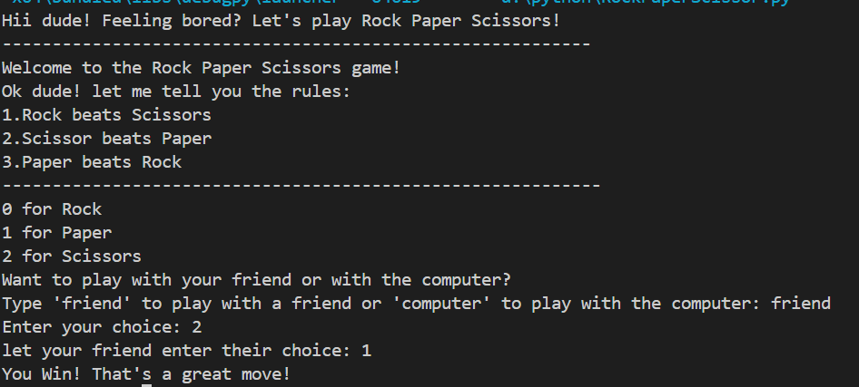

# Rock-Paper-Scissor-Game-Python-
#🎮 Rock Paper Scissors Game – Python Edition 

**Feeling bored? Challenge your friend or the computer to a classic game of Rock Paper Scissors!**

🔗This interactive Python script features:
- Friendly prompts and playful commentary 😄
-  Clear rules and input validation
- Two modes: Friend vs Friend and Player vs Computer

**Perfect for beginners learning conditionals, user input, and randomization.**

